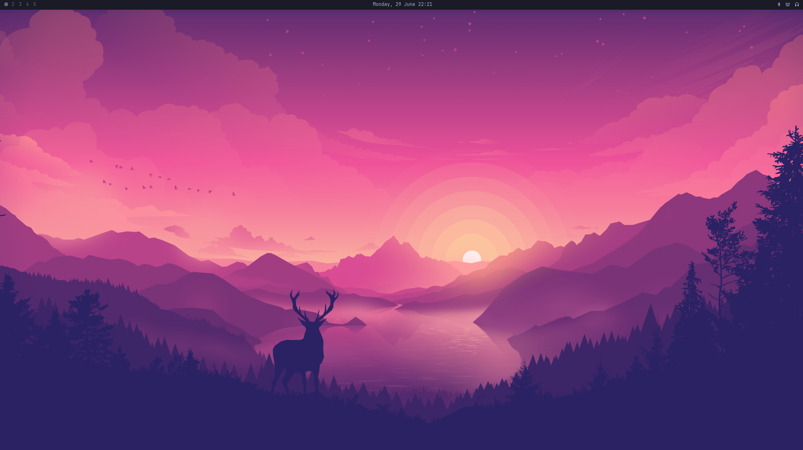

# Omanix



Omanix is a NixOS port of [Omarchy](https://omarchy.org). It brings the same curated, keyboard-driven Hyprland experience to NixOS while embracing the Nix philosophy: everything is declarative, reproducible, and configured at build time.

## What You Get

A complete Hyprland desktop out of the box:

- **Window Management** - Hyprland with sensible defaults, dwindle layout, animations, and blur
- **App Launcher** - Walker with Elephant as the data provider (apps, files, clipboard, calculator, web search, symbols)
- **Status Bar** - Waybar, fully themed, toggleable
- **Terminal** - Ghostty with Zsh, Starship prompt, and a curated set of shell tools (eza, ripgrep, fd, fzf, bat, direnv)
- **Editor** - Neovim via LazyVim with per-language support you opt into
- **Notifications** - Mako with Do Not Disturb mode
- **Lock Screen** - Hyprlock with themed clock and wallpaper blur
- **Idle Management** - Hypridle with screensaver, dimming, locking, DPMS, and suspend — all configurable
- **Screenshots** - Region/window/fullscreen capture via grim + slurp + Satty editor
- **Screen Recording** - wl-screenrec with VAAPI hardware encoding and optional audio
- **Theming** - Declarative themes that propagate to every component (terminal, bar, lock screen, notifications, browser chrome, btop, bat, Walker, SwayOSD)
- **Menu System** - Nested Walker-based menus for style, capture, sharing, system controls, and documentation

### Where Omanix Departs from Omarchy

Since NixOS is a fundamentally different paradigm from Arch, some things work differently:

- **No runtime theme switching.** Themes are applied at build time. You change your theme in your flake and rebuild. A preview mode lets you try wallpapers temporarily.
- **No TUI package installer.** Installing packages imperatively goes against the Nix philosophy. Everything is declared in your config.
- **Zsh instead of Bash.** Omanix uses Zsh with Oh My Zsh, autosuggestions, and syntax highlighting as the default shell.
- **Everything is a module option.** Apps, languages, visual tweaks, and idle behaviour are all configurable through typed NixOS/Home Manager options.
- **wl-screenrec instead of gpu-screen-recorder.** Omanix records the screen with wl-screenrec (Hyprland's screencopy + VAAPI hardware encoding) for a simpler setup. There is no webcam overlay.

## Quick Start

Add Omanix to your flake inputs, import both modules, and rebuild:

```nix
omanix = {
  url = "github:T00fy/omanix";
  inputs.nixpkgs.follows = "nixpkgs";
  inputs.home-manager.follows = "home-manager";
};
```

```nix
omanix.enable = true;
```

```bash
sudo nixos-rebuild switch --flake .
```

For the full setup walkthrough, see the **[Getting Started](https://t00fy.github.io/omanix/getting-started.html)** guide.

## Documentation

Full documentation is available at **[t00fy.github.io/omanix](https://t00fy.github.io/omanix/)**.

- [Getting Started](https://t00fy.github.io/omanix/getting-started.html) — add Omanix to your flake
- [Configuration Guide](https://t00fy.github.io/omanix/configuration.html) — common patterns with examples
- [Options Reference](https://t00fy.github.io/omanix/nixos.html) — every `omanix.*` option with types and defaults

## Keybindings

Omanix ships with comprehensive keybindings that closely match Omarchy. Rather than listing them all here, you can:

- Press **Super+K** to open the keybindings viewer from within Omanix
- Press **Super+Alt+Space** to open the main menu, then navigate to **Learn → Keybindings**
- Refer to the [Omarchy Hotkeys Manual](https://learn.omacom.io/2/the-omarchy-manual/53/hotkeys) — the bindings are nearly identical

## Themes

Omanix currently ships with **Tokyo Night**. Themes are defined in `lib/themes.nix` and contain everything: colour palette, wallpapers, bat syntax theme, and icon theme.

### Adding a Theme

To add a new theme, create a PR that adds an entry to `lib/themes.nix`. Each theme needs:

```nix
{
  my-theme = {
    meta = {
      name = "My Theme";
      slug = "my-theme";
      icon_theme = "Yaru-blue";      # Any icon theme available in nixpkgs
    };

    assets.wallpapers = [
      ../assets/wallpapers/my-theme/wallpaper-1.jpg
      ../assets/wallpapers/my-theme/wallpaper-2.jpg
    ];

    bat = {
      name = "theme-name";           # As listed in `bat --list-themes`
      url = "https://raw.githubusercontent.com/.../theme.tmTheme";
      sha256 = "sha256-...";
    };

    colors = {
      background = "#...";
      foreground = "#...";
      accent = "#...";
      cursor = "#...";
      selection_background = "#...";
      selection_foreground = "#...";
      color0 = "#...";  color1 = "#...";  color2 = "#...";  color3 = "#...";
      color4 = "#...";  color5 = "#...";  color6 = "#...";  color7 = "#...";
      color8 = "#...";  color9 = "#...";  color10 = "#..."; color11 = "#...";
      color12 = "#..."; color13 = "#..."; color14 = "#..."; color15 = "#...";
    };
  };
}
```

Place wallpapers in `assets/wallpapers/your-theme/` and include them in the PR.

## Contributing

Contributions are welcome! Some ideas:

- **New themes** — the easiest way to contribute. Follow the schema above and open a PR.
- **New optional apps** — add a module under `modules/home-manager/apps/`. Everything should default to `false` (or use `mkEnableOption`) so users opt in explicitly. The module should integrate with the active theme where appropriate.
- **Bug fixes and improvements** — if you find something that doesn't work or could work better, PRs and issues are appreciated.
- **Documentation** — improvements to the docs under `docs/` are always helpful.

I haven't optimized this for laptops either - because I'm personally not using this on a laptop. Things like battery/power settings are unlikely to be working. PR's addressing this are appreciated
